# Ikkyee Full Service Audit

Date: 2026-08-10  
Branch/commit: `dev` / `7727e22967c23249c596e6b6ff8c96ffe678fb7e`  
Production: `https://practice-week1-cws.pages.dev`  
Scope: tracked repository inventory, product documents, frontend structure, Supabase schema and live aggregates, Cloudflare responses, automated verification, and desktop/mobile browser QA.

## Overall Verdict

Ikkyee has a clear and differentiated core: private travel photos become a map-based archive, with controlled public discovery as a secondary experience. The upload, album, privacy, signed-storage, Explore, profile, OAuth, backup, and release foundations are unusually complete for a pre-beta vanilla SPA.

The original code snapshot was not ready for unrestricted public beta. The confirmed code and data blockers below were repaired on 2026-08-10; fresh social sign-up, real-device QA, legal/support approval, and Google Maps legacy API migration remain open.

## Remediation Update

- Resolved findings: 1-7, 9-15.
- Like data now has 4 rows, a stored total of 4, and 0 mismatched photos. The authenticated-only `set_photo_like` RPC owns row and count changes atomically.
- Runtime fallback and demo images now use Vite-tracked `import.meta.url` assets; all five images appear in the production build.
- New social accounts now start with an empty stored avatar and a neutral name. Provider metadata is applied only through the existing user-confirmed Kakao flow.
- Album fields are grouped correctly. Modal focus moves inside, cycles with Tab, closes with Escape, and returns to the invoking control.
- The obsolete profile modal and duplicate ID were removed; the header profile button has an accessible name.
- Vite is updated to 8.2.1, the Supabase CDN is pinned to 2.112.2, and both full and production-only dependency audits report 0 vulnerabilities.
- `tmp/` is ignored without deleting user files. README and the current service specification now match the implementation.
- Cloudflare Pages now sends a source-restricted CSP for Supabase, Google Maps, and Turnstile, while fingerprinted `/assets/*` responses use a one-year immutable cache. HTML keeps Cloudflare's revalidation behavior and `/api/config` remains `no-store`.
- The public Home opening now presents one clear photo-upload action inside the first viewport. Logged-out visitors continue through the existing login handoff, while authenticated visitors continue directly to upload.
- The disposable database sample library was reset: 21 photos, 3 albums, and all dependent content rows are now zero. Auth accounts and profiles remain at 3, and logged-out Production Explore shows the intended empty state. The 31 now-unlinked private Storage objects remain queued for authenticated Storage API/Dashboard cleanup.
- Verification after remediation: 464/464 tests, production build, dependency audit, and performance budget all pass. Desktop 1440x900 and mobile 390x844 browser checks show no horizontal overflow or visible broken images.

## Confirmed Findings

### P0 - Fix Before Public Beta

1. **Like totals are wrong in live data.**
   - Live aggregate: 4 `user_likes` rows, but `photos.liked` totals sum to 0; 4 of 21 photos are mismatched.
   - The client inserts/deletes the user row, then calls `increment_like` or `decrement_like` ([app.js](../../js/app.js#L1557)).
   - Those functions are revoked from ordinary roles and granted only to `service_role` ([schema.sql](../../supabase/schema.sql#L742)), while the client deliberately treats the permission failure as success ([auth.js](../../auth.js#L398)).
   - Expected fix: make one authenticated, idempotent database operation own both the row and count, backfill counts, and test concurrent like/unlike behavior.

2. **Dynamic fallback images break in production.**
   - A profile with no public cover shows a broken image in Step 9. Runtime code assigns `images/main_bg4.jpg` ([app.js](../../js/app.js#L2390)), but Vite only deploys the hashed asset path.
   - Requests such as `/images/main_bg4.jpg` return the SPA HTML shell with `200 text/html`, not an image.
   - The same pattern appears in photo fallbacks, demo data, public trips, profile cards, and album placeholders ([app.js](../../js/app.js#L331), [public-demo-data.mjs](../../js/public-demo-data.mjs#L1), [public-profile-hero.mjs](../../js/public-profile-hero.mjs#L1)).
   - Expected fix: import static assets in modules or expose intentional public assets from `public/`, then add a production-build asset contract test.

3. **Fresh Google/Kakao sign-up still conflicts with the new default-avatar rule.**
   - The frontend intentionally leaves a new provider profile avatar empty ([account-profile.mjs](../../js/account-profile.mjs#L10)).
   - The live `handle_new_user` trigger still imports provider `avatar_url`/`picture`; the committed migration does the same ([20260731055802_canonical_account_profiles.sql](../../supabase/migrations/20260731055802_canonical_account_profiles.sql#L21)).
   - Result: a truly new social account can receive the provider avatar before the user chooses it, bypassing the branded default behavior.
   - Expected fix: align the trigger with the frontend rule, then complete never-used-account Google and Kakao sign-up QA.

### P1 - High Priority

4. **The desktop album form layout is structurally broken.**
   - Step 11 shows the `설명` label detached at the far right and the textarea placed under the wrong column.
   - Markup emits labels and controls as separate grid children ([app.js](../../js/app.js#L3646)), while CSS defines only three columns and appears to expect grouped fields ([style.css](../../style.css#L4187)).

5. **Modal keyboard behavior is incomplete.**
   - Opening Login leaves focus on the background `Login` button.
   - `openModal` only changes classes and `aria-hidden`; it does not move focus, trap focus, restore focus, or close general modals with Escape ([app.js](../../js/app.js#L600)).
   - This blocks reliable keyboard and screen-reader use.

6. **The profile thumbnail button has no accessible name.**
   - Browser accessibility output reports an unnamed button because the image has empty alt text and the fallback icon is hidden from assistive technology ([index.html](../../index.html#L42)).
   - Add an `aria-label` such as `내 프로필 열기`.

7. **Duplicate profile edit IDs and an obsolete profile modal remain.**
   - `account-profile-edit` appears twice ([index.html](../../index.html#L533), [index.html](../../index.html#L785)).
   - `querySelector`/`getElementById`-style access binds only the first match, making behavior dependent on source order. The static account-profile modal also appears to be superseded by the profile page renderer.

8. **Google Maps uses two legacy APIs.**
   - Runtime warnings identify `google.maps.places.Autocomplete` and `google.maps.Marker` as legacy/deprecated.
   - Current uses start at [app.js](../../js/app.js#L1143) and [app.js](../../js/app.js#L1174).
   - Migrate to `PlaceAutocompleteElement` and `AdvancedMarkerElement` before an API policy change forces a rushed update.
   - Deferred prerequisite: create a Google Maps Map ID for advanced markers and enable Places API (New), then verify billing restrictions and both Cloudflare domains before changing runtime code.

9. **Development dependencies have three high-severity advisories.**
   - Production dependency audit is clean, but the full audit flags Vite 8.0.10, Nano ID 3.3.12, and PostCSS 8.5.13.
   - Patch updates are available. Verify all 458 tests and the performance budget after updating.

10. **The current release gate is blocked by unrelated local files.**
    - `npm run release:rehearse` fails because untracked `tmp/` makes the entire worktree dirty ([rehearse-public-beta-release.sh](../../scripts/rehearse-public-beta-release.sh#L47)).
    - The gate should reject tracked changes while ignoring an explicitly approved local temp directory.

### P2 - Product And Maintenance

11. **The main project documentation is stale and contradictory.**
    - `README.md` still describes removed `main.js`, `login.html`, Leaflet, comments, and the old My Stories/Community model ([README.md](../../README.md#L15)).
    - `docs/spec.md` is a narrow historical nickname task, although repository guidance describes it as the current requirements ledger ([spec.md](../spec.md#L1)).
    - The v2.1 plan requires `Home / Myphoto / Explore`, while the current tested decision intentionally folds Myphoto into Home ([app-sections.mjs](../../js/app-sections.mjs#L13)).
    - The plan also both includes subscriptions in MVP and defers them elsewhere. A single current product spec is needed.

12. **Resolved: the Content Security Policy was only a partial baseline.**
    - It protects framing, objects, and base URLs, but has no `default-src`, `script-src`, `connect-src`, `img-src`, or `style-src` restrictions ([public/_headers](../../public/_headers#L1)).
    - This matters because the SPA renders many strings through `innerHTML` and loads a floating `@supabase/supabase-js@2` CDN version without SRI ([index.html](../../index.html#L829)).

13. **Resolved: fingerprint assets were not cached long-term.**
    - Production `/assets/index-*.js` responds with `Cache-Control: public, max-age=0, must-revalidate`.
    - Hashed assets can safely use a long immutable cache while HTML and `/api/config` remain non-cacheable/revalidated.

14. **Resolved: the main Home value proposition was action-light above the fold.**
    - Step 1 communicates mood and brand, but the primary promise and upload action are below the first viewport.
    - A concise primary action near the opening copy would reduce the distance from understanding to first upload.

15. **Resolved: public sample content lowered launch credibility.**
    - Step 2 and Step 7 expose test titles, very long strings, and low-quality/private-looking sample imagery.
    - The existing decision permits deleting all pre-launch sample content; use a small curated starter set or a polished empty state before launch.

## What Is Working Well

- 464 of 464 automated tests pass after remediation.
- Production build and JavaScript/CSS/image performance budgets pass.
- Supabase is `ACTIVE_HEALTHY`; all seven public tables have RLS enabled.
- Supabase security advisor reports the intentionally exposed, authenticated-only `set_photo_like` SECURITY DEFINER RPC and the deferred [leaked-password protection setting](https://supabase.com/docs/guides/auth/password-security#password-strength-and-leaked-password-protection). The RPC validates `auth.uid()`, photo access, and grants before writing.
- Private Storage, 15-minute signed URLs, location precision, and owner/non-owner policies are implemented.
- Production and Preview expose baseline security headers; Preview correctly adds `X-Robots-Tag: noindex`.
- `dev` and `main` currently point to the same verified commit.
- Desktop and mobile Home/Explore layouts have no horizontal overflow at the tested 1280x720 and 390x844 viewports.
- The authenticated Home empty states, upload entry, and map-first Explore model are clear and coherent.

## Product Scope Decision Needed

Use this as the current MVP definition unless the owner decides otherwise:

1. Home combines the public introduction and the signed-in private workspace.
2. Explore remains the only surface for browsing other users' public photos.
3. Upload, private photo archive, albums, public review, public profile, likes, and share links stay in MVP.
4. Comments, subscriptions, ranking, recommendations, notifications, and time-precision controls stay after beta.
5. Legal/support/retention approval, fresh social sign-up QA, and iOS Safari/Android Chrome QA remain launch gates.

## Browser Audit Steps

### 1. Logged-out Home desktop - Resolved after audit

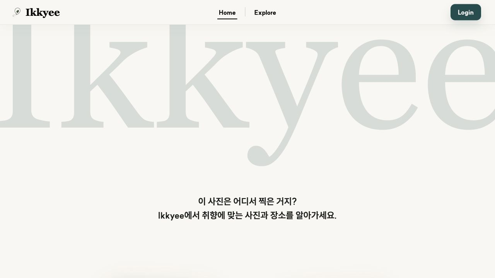

Strong identity and stable layout. The first viewport lacks a direct upload/start action.

### 2. Logged-out Explore desktop - Resolved after audit

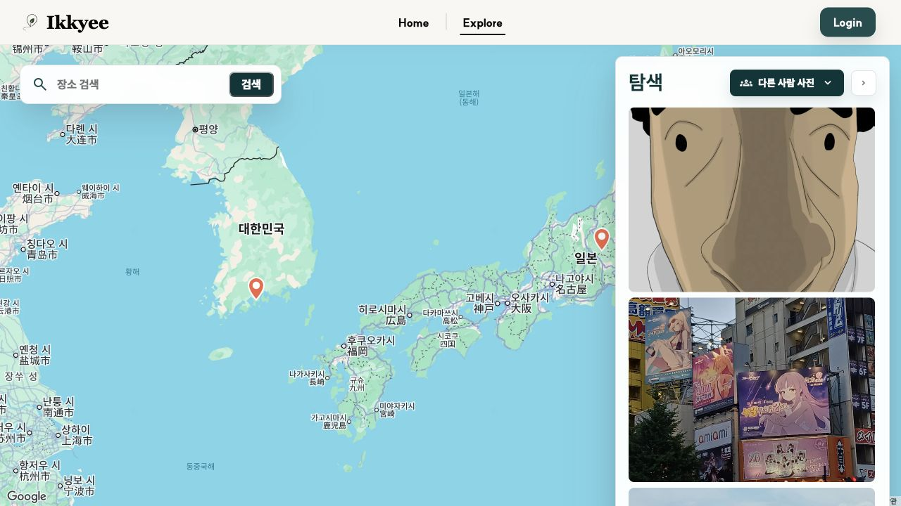

Map-first layout and search are clear. Current public samples do not look launch-ready.

### 3. Login desktop - Healthy visually, accessibility risk

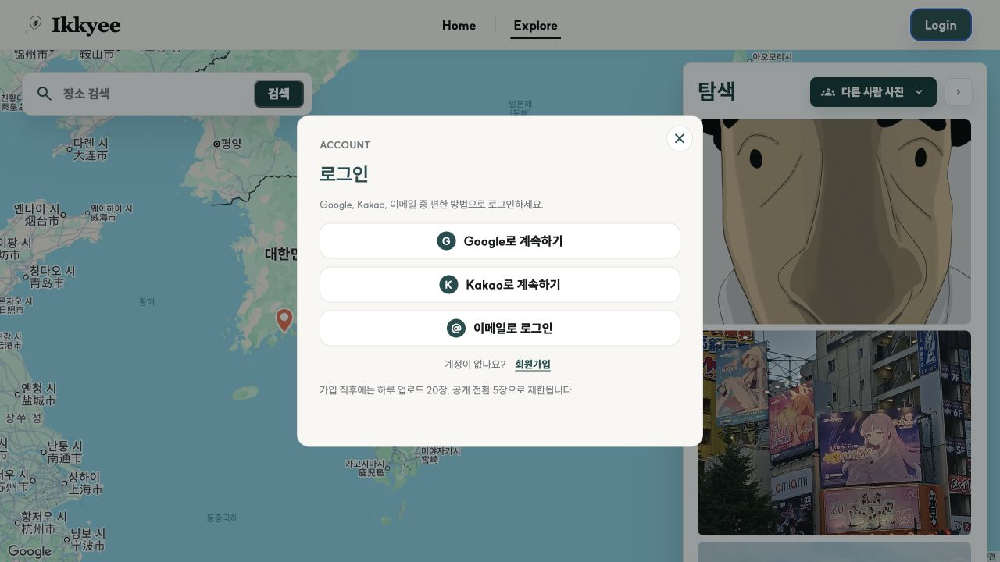

Provider choices are easy to scan. Focus remains behind the dialog after opening.

### 4. Logged-out Home mobile - Healthy

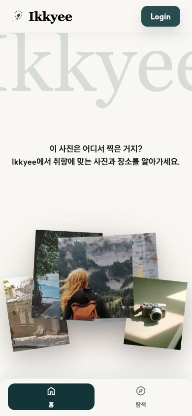

Brand, collage, and bottom navigation fit without horizontal overflow.

### 5. Logged-out Explore mobile - Healthy with a minor clarity risk

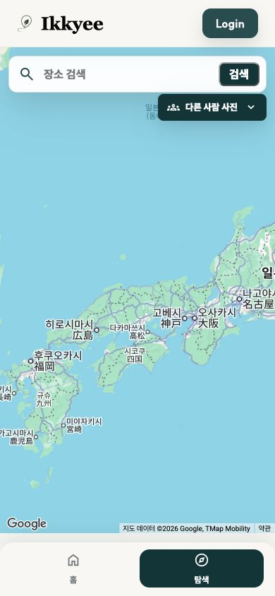

Search and scope controls are reachable. A loading/empty distinction should remain visible when pins are outside the current viewport.

### 6. Login mobile - Healthy visually, accessibility risk

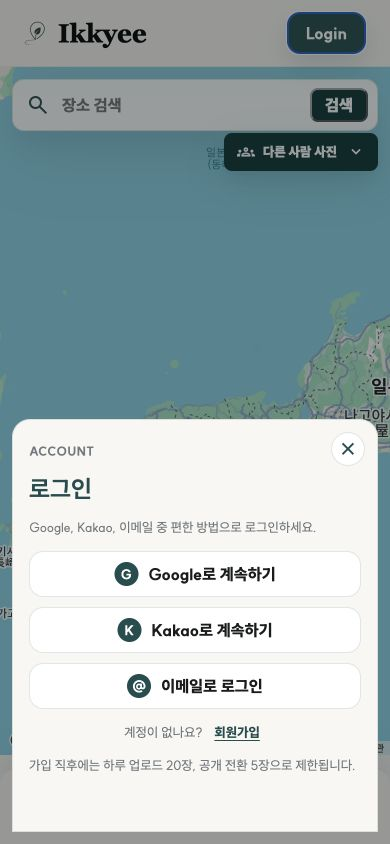

The bottom sheet fits the viewport. The same focus-management limitation applies.

### 7. Explore photo panel - Historical sample removed

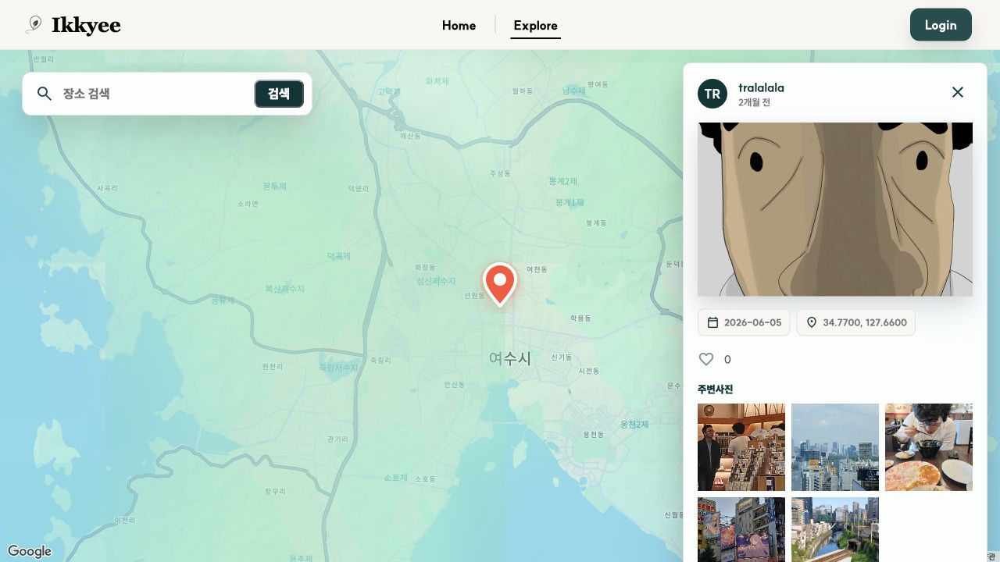

Author, photo, location, like, and nearby-photo hierarchy is understandable. The selected sample image is not suitable as public launch content.

### 8. Authenticated Home - Healthy

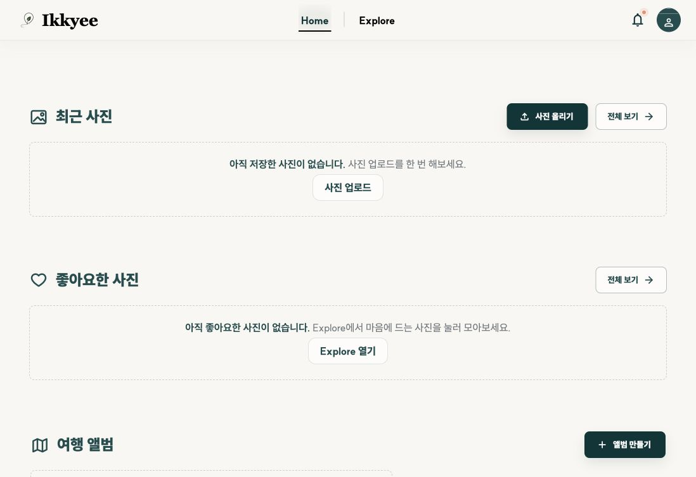

Empty states direct users toward upload, Explore, and album creation without exposing backend details.

### 9. Authenticated profile - Blocked by broken fallback cover

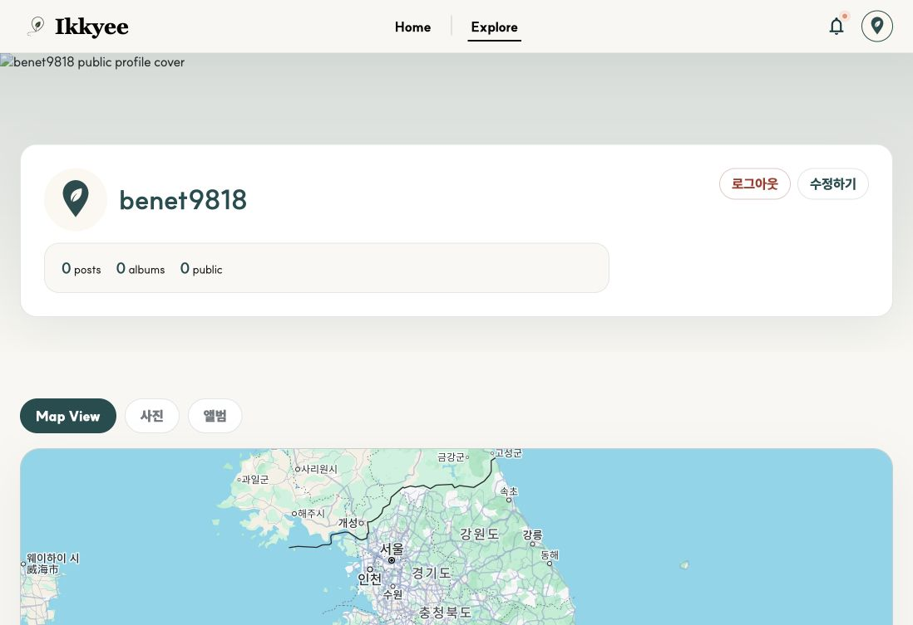

The branded default avatar renders correctly. The default profile cover request fails in production.

### 10. Authenticated upload - Healthy

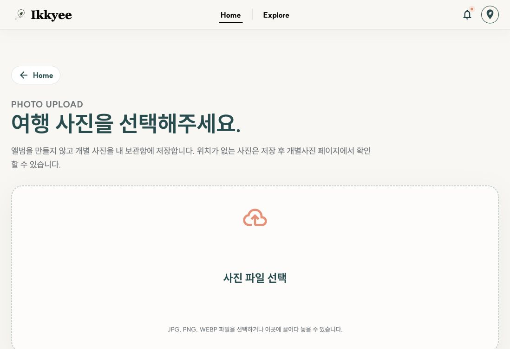

The upload purpose, supported formats, and drop target are clear. Actual file lifecycle remains covered by prior manual QA rather than this non-destructive audit.

### 11. Authenticated album builder - Needs layout repair

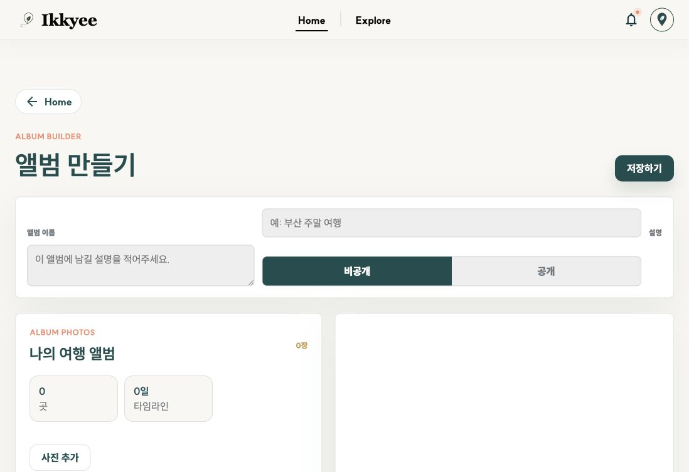

The creation sequence is understandable, but the basic-information grid misplaces labels and controls on desktop.

## Verification Limits

- No new personal photo was uploaded, published, liked, or deleted during this audit.
- Never-used Google and Kakao accounts were not available, so fresh social sign-up remains deferred.
- iOS Safari and Android Chrome were not available; responsive emulation is not a substitute for real-device camera/file picker, OAuth handoff, safe-area, and map gesture QA.
- Screenshot review does not prove WCAG compliance. Keyboard focus behavior and accessible names were checked directly where noted; contrast, screen-reader announcements, and full tab order still need dedicated testing.

## Recommended Execution Order

1. Repair like persistence and backfill counts.
2. Replace every dynamic local image literal with build-safe asset URLs.
3. Align the social sign-up trigger with the default-avatar decision.
4. Fix the album form grid and modal/profile accessibility defects.
5. Update Vite dependencies and prepare the Google Cloud prerequisites for the Maps legacy API migration.
6. Consolidate product docs, harden CSP/cache behavior, and make the release rehearsal ignore approved local temp output.
7. Clean sample content, complete fresh OAuth and real-device QA, then approve legal/support/retention copy.
