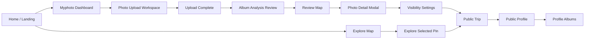

# Stitch-First Screen Inventory

Source: Stitch project `Personal Travel Map Archive` (`projects/8047004610886948075`)

Date checked: 2026-05-28

## Scope

This inventory treats Stitch as the product source of truth. The current `dev` branch is preserved as a checkpoint only. Existing upload, map, photo, profile, and data behavior may be reused, but screen structure and visual priority should follow Stitch.

Stitch exposes 15 visible canonical screens through `list_screens`. Hidden screen instances exist in the project as draft/variant work; they are not treated as implementation targets unless promoted later.

## Design Source

- Brand: `Travelgram / Ikkyee`
- Visual system: `Archival Horizon`
- Mood: calm personal travel archive, map-first utility, quiet privacy
- Primary colors: Deep Teal `#1A4D4E`, Soft Coral `#F48C71`, Warm Ivory `#F9F7F2`, Private Gold `#C9A050`
- Typography: `Be Vietnam Pro` for headings, `Hanken Grotesk` for body/UI labels
- Layout rule: desktop split map/content surfaces; mobile bottom-sheet behavior later

## Core Flow

## Screen Inventory

| Stitch screen | Role | Main connections | Needed data | Current code reflection |
| --- | --- | --- | --- | --- |
| `Home / Landing: Archival Archive Tool` | Website entry page. Explains photo-to-map value, recent private albums, public examples, photo preview. | CTA to Myphoto upload flow; CTA to Explore. | Recent albums, public album examples, public photo preview, static feature copy. | Partially reflected in `index.html#panel-home`, but current copy/layout is simpler and more web-tool-like than Stitch. Needs Stitch landing sections and Korean copy priority. |
| `My Photos Dashboard: Optimized Stream Layout` | Private archive dashboard. Shows upload/create album actions, location issue task, recent photos, albums. | Upload, album creation/review, review map, profile/album surfaces. | Current user photos, custom albums, photos missing GPS, upload/task counts. | Strong reusable base exists in `#panel-explore` with `state.viewMode = "my"`, `render.js`, `profile.js`; needs page identity and structure to become Myphoto dashboard rather than generic feed. |
| `사진 올리기: 파일 선택 전` | Simple upload entry state before choosing files. | Starts photo selection, returns to Myphoto. | None beyond current user state. | Exists in `#panel-upload` start state, but current text is English and not as compact as Stitch. |
| `Photo Upload: Myphoto Workspace` | File selection/review workspace with upload summary and privacy notice. | Choose files, retry/remove preview, start upload. | Selected file list, estimated date range, total selected count, validation errors. | Existing `upload.js` can process files and show summary after upload. Missing pre-upload selected-file review parity. |
| `사진 올리기: 업로드 완료` | Upload result screen. Shows total, success, error, next step. | Continue to photo info/review map; retry failed photos. | Upload result, success/error count, missing location count. | Good reusable base in `upload.js#showUploadComplete`, `#upload-complete-state`; copy/style should match Stitch Korean screen. |
| `앨범 만들기: 분석 결과 확인` | Analysis/reconciliation step for locationless photos and representative photo. | Direct map placement, GPX matching, skip, return Myphoto, choose cover. | Photos missing location, candidate route/date clusters, album draft, representative image. | Current `#panel-album-review` is album summary, not this exact analysis role. Existing location picker can be reused; GPX matching is not implemented. |
| `Review Map: Unified Date Divider Style` | Private trip review map combining route, date dividers, share/privacy/edit/photo-add controls. | Detail modal, photo add, privacy settings, public trip preview. | Album/trip metadata, day groups, route pins, shared/private status, map bounds. | Partially implemented through `render.js` date groups, route polyline, `#review-map-summary`. Needs album-specific review surface and Stitch toolbar. |
| `Photo Detail Modal: Archival Archive View` | Focused photo detail over map/archive context. | Edit location, view album, delete, close, previous/next. | Photo URL variants, date/time, location, album, owner, comments/likes. | Strong reusable base in `detail.js`; current panel is not visually modal enough and has extra social controls. |
| `공개 설정` | Privacy/publication control for album/photo. | Save privacy, create share link, keep private, preview public view. | Visibility state, exact/approx/hidden location choice, time visibility choice, selected public photos, EXIF stripping status. | Basic public/private toggle exists in `#panel-share-settings` and `events.js`; needs album-level options and location/time granularity. |
| `Explore: Updated Detailed Map Background` | Public discovery map with empty-region state and map controls. | Selected pin sidebar, move to dense public regions, Myphoto/Home nav. | Public photos/albums, map clusters, current viewport result count. | Strong map base exists in `render.js` and Leaflet setup. Current map exists but background/detail style and empty-region messaging need Stitch parity. |
| `Explore: Selected Pin Sidebar View` | Public selected-pin sidebar preview. | Public album page, author profile, like, return to list. | Selected public photo/album, author profile, likes, related album. | Partially reflected in `#panel-detail` selected-pin summary; should become a public sidebar state separate from private detail. |
| `Public Trip: Jeju East Coast Drive` | Public album/trip page with hero, route, days, author, related albums. | Author profile, share/favorite, profile’s other public albums. | Public album, route stops, day timeline, likes, author, related public albums. | `#panel-public-trip` exists and can be reused; needs Stitch editorial/public page layout and richer author/related album sections. |
| `Public Profile: Map View Tab` | Public user profile focused on map footprint. | Profile tabs, public album/photo views, add/location action for owner. | Public user, public photos, map bounds, stats, follow state. | `profile.js` has profile page, photos/albums toggles, counts. Needs Stitch tab language and map-first content hierarchy. |
| `Public Profile: Albums Tab` | Public user profile focused on album grid. | Public trip pages, load more, map tab. | Public albums, cover images, date ranges, counts. | `profile.js` supports album folders/custom albums and preview entry; needs public-facing card design and data separation. |
| `Travelgram Prototype` | Duplicate of Home/Landing prototype. | Same as Home. | Same as Home. | Treat as duplicate reference only, not a separate route. |

## Reuse Candidates

- Keep: Vite static website shell, Leaflet/Google map integration, Supabase-style auth/data calls in `auth.js`, photo upload/compression/storage flow in `js/upload.js`, map markers and route polyline in `js/render.js`, location picker/editing in `js/detail.js` and `js/events.js`, profile/album grouping in `js/profile.js`.
- Rework: `index.html` section layout, English copy, generic feed naming, detail/share/profile surface hierarchy, visual tokens in `style.css`.
- Add later: GPX matching, album-level visibility granularity, selected-file pre-upload workspace, exact/approx/hidden location privacy controls, public trip author/related-album sections.

## Implementation Priority

1. Website shell and landing page must clearly read as a website, not an installable app.
2. Myphoto dashboard and upload flow should become the private archive spine.
3. Review map and detail should preserve existing map/data behavior while matching Stitch surfaces.
4. Public discovery, public trip, and public profile can iterate after the private archive flow is coherent.
